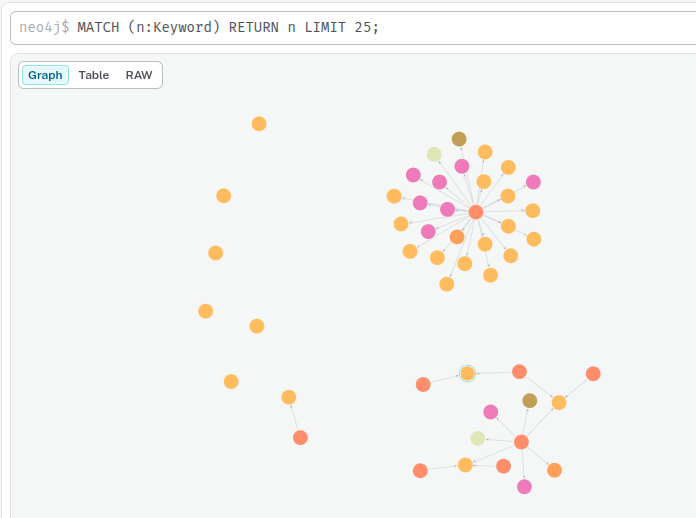

# NBG-PT

NBG-PT ist eine Webanwendung, mit der sich der offene Datenbestand der Stadt Nürnberg über einfache Textanfragen durchsuchen lässt.  
*(Quelle der Daten: [BayernData Nürnberg](https://nuernberg.bydata.de/?locale=de))*

Bei den verwendeten Daten handelt es sich um Datensätze und die dazugehörigen Metadaten, die über die API der Stadt Nürnberg abgerufen und in einer Neo4j-Datenbank gespeichert wurden. Das folgende Bild zeigt die grafische Visualisierung dieser verknüpften Datensätze in der Weboberfläche der Datenbank.

## Funktionsweise

Das Projekt nutzt den Ansatz von [GraphRAG](https://neo4j.com/blog/genai/what-is-graphrag/) in Verbindung mit der erwähnten Neo4j-Datenbank. 

In der Datenbank werden die Keywords und Kategorien der Datensätze als Embeddings gespeichert. Dafür kommt lokal das Modell `jina-embeddings-v2-base-de` zum Einsatz. 

Bei einer Nutzeranfrage werden die Embeddings mit dem Anfragetext verglichen. Die relevantesten Keywords und Kategorien dienen dem System dann als Startpunkte für die Suche im Graphen. Ausgehend von diesen Punkten wird der Graph nach passenden Datensätzen und deren Beschreibungen durchsucht. Der so gefundene, relevante Kontext wird anschließend an ein lokales Sprachmodell (`qwen3`) übergeben, um die Anfrage des Nutzers zu beantworten.

## Aufbau des Projekts

Das Projekt besteht aus zwei Hauptteilen:

- **Datenvorbereitung:** Python-Skripte, die Metadaten zu den verfügbaren Datensätzen herunterladen und so in der Datenbank aufbereiten, dass sie durchsuchbar werden.

- **Webanwendung:** Das Kernstück ist ein Chat-Interface (Frontend & Backend). Wenn ein Nutzer eine Frage stellt, sucht das System die passenden Informationen aus der Datenbank heraus. Ein KI-Modell liest diese Informationen und formuliert daraus eine direkte, verständliche Antwort für den Nutzer.
